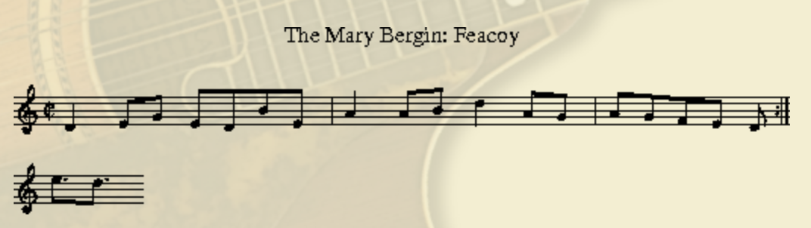
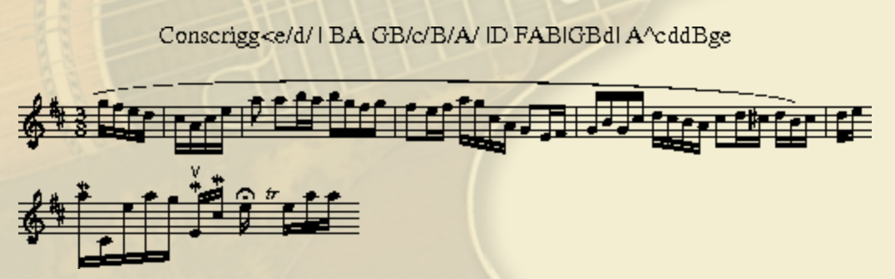
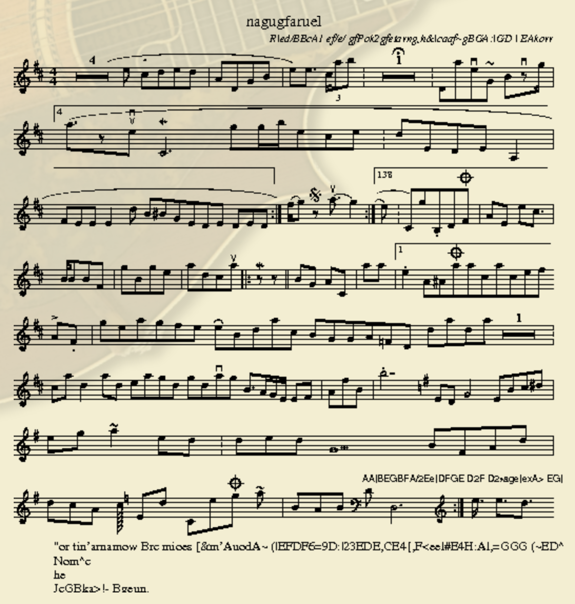

# Music Generation with LSTM

## Sample Results
* temperature = 0.5

* temperature = 1.0

* temperature = 2.0

## Acknowledgment
This is a class project from UCSD CSE253 Winter 2018
Ohter team members: Muyun Liu, Zining Wang, Zhipeng Yao